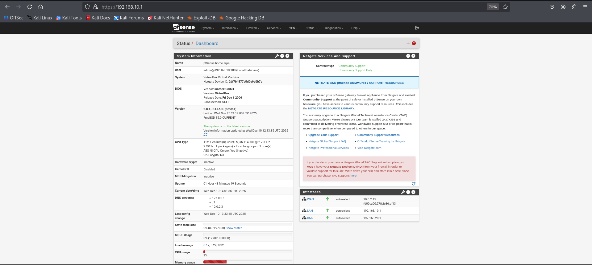
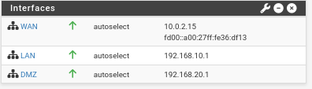
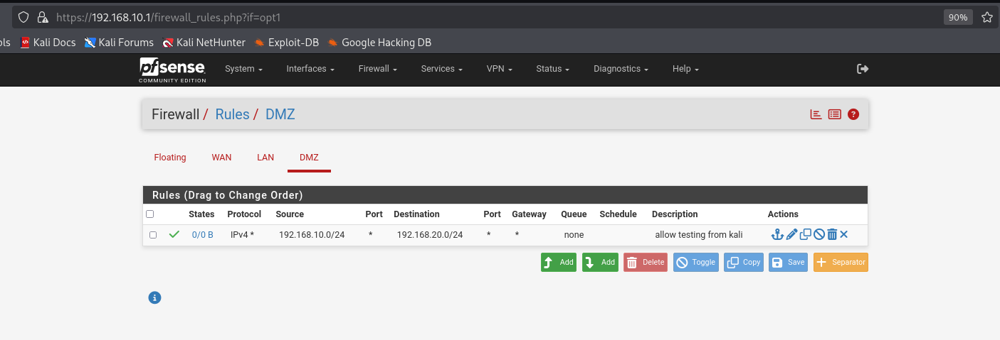
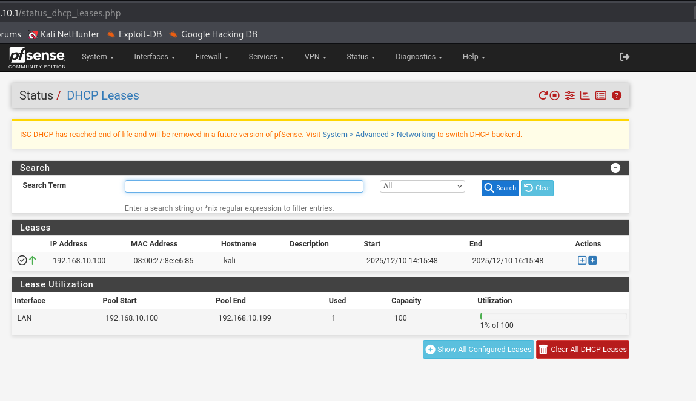
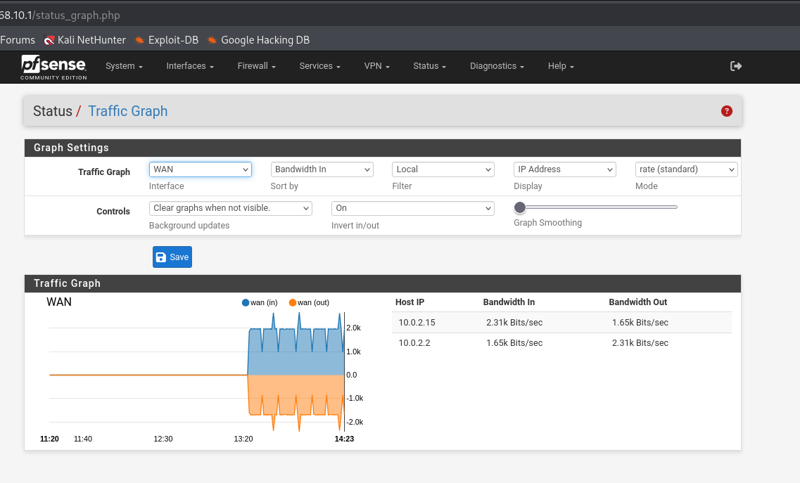
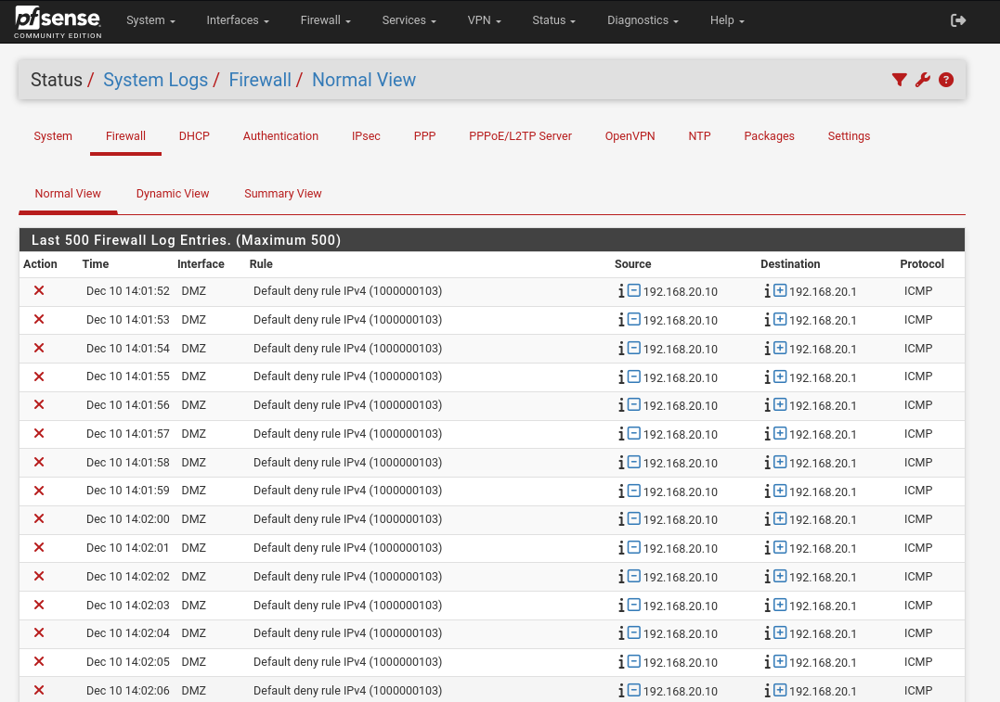
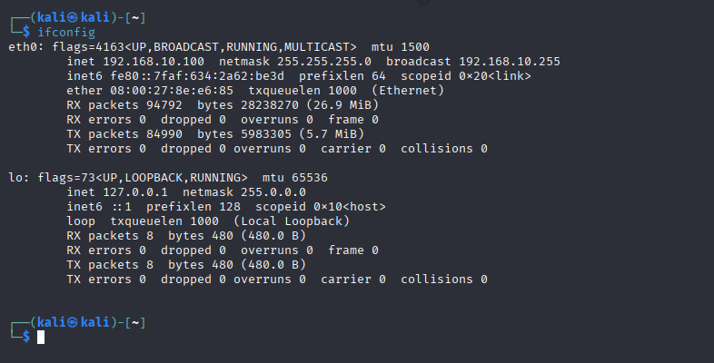
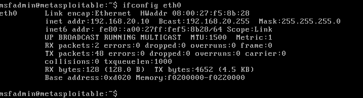

# 🔐 Cybersecurity Home Lab

## 🎯 Overview
A hands-on network security lab built from scratch to demonstrate practical cybersecurity skills. This project simulates a real-world enterprise network environment with proper segmentation, firewall configuration, and security testing.

## 🏗️ Network Architecture
[Internet] → [pfSense Firewall/Router] → [LAN Segment: Kali Linux]
↘ [DMZ Segment: Metasploitable Server]

IP Addressing:
• pfSense LAN: 192.168.10.1/24
• Kali Linux: 192.168.10.100/24
• pfSense DMZ: 192.168.20.1/24
• Metasploitable: 192.168.20.10/24

text

## 🛠️ Technologies Used
| Technology | Purpose | Version |
|------------|---------|---------|
| **pfSense** | Enterprise Firewall & Router | 2.8.1 CE |
| **Kali Linux** | Penetration Testing Platform | 2024.1 |
| **Metasploitable** | Vulnerable Target System | 2.0 |
| **VirtualBox** | Virtualization Platform | 7.0+ |
| **Nmap** | Network Scanner | 7.94 |

## 📁 Project Structure
cybersecurity-home-lab/
├── 📸 screenshots/ # Configuration screenshots
│ ├── pfsense_dashboard.png
│ ├── pfsense_interfaces.png
│ ├── pfsense_firewall_rules.png
│ ├── kali_ifconfig.png
│ ├── metasploitable_ifconfig.png
│ └── nmap_scan_results.png
│ └── pfsense_dhcp_leases.png
│ └── pfsense_traffic_graph.png
│ └── pfsense_firewall_logs.png
├── 🔍 scans/ # Security scan results
│ └── (Nmap output files)
├── 📄 documents/ # Network diagrams & notes
│ └── network_architecture.txt
└── 📋 README.md # This file

text

## 📸 Lab Screenshots Gallery

### 🔧 **pfSense Configuration**
| Screenshot | Description | Key Takeaway |
|------------|-------------|--------------|
|  | **Main Dashboard** - Overview of all interfaces, system status, and traffic graphs | Shows WAN, LAN, and DMZ interfaces all operational with real-time monitoring |
|  | **Interface Assignments** - Network port configuration for WAN, LAN, and DMZ | Demonstrates proper network segmentation with separate interfaces for each security zone |
|  | **DMZ Firewall Rules** - Security policies controlling traffic between network segments | Implements principle of least privilege: LAN→DMZ allowed, DMZ→LAN restricted |
|  | **DHCP Server Leases** - Automatic IP address assignment in LAN segment | Shows Kali Linux (192.168.10.100) successfully obtaining IP from pfSense DHCP server |
|  | **Network Traffic Analysis** - Real-time bandwidth monitoring per interface | Provides visibility into network activity between segments for security monitoring |
|  | **Firewall Log Viewer** - Security event logging and analysis | Essential for incident response - shows allowed/blocked connection attempts |

### 🎯 **Security Testing Environment**
| Screenshot | Description | Security Relevance |
|------------|-------------|-------------------|
|  | **Kali Linux Network Config** - Penetration testing workstation in LAN segment | Attack platform (192.168.10.100) positioned inside protected network for authorized testing |
|  | **Metasploitable Target Server** - Vulnerable system in isolated DMZ | Deliberately vulnerable target (192.168.20.10) in isolated zone for safe security training |
|  | **Vulnerability Assessment** - Nmap port scan results from Kali to Metasploitable | Identifies open ports (21/FTP, 22/SSH, 80/HTTP) and vulnerable services for remediation |

## 🔗 Quick Navigation to Key Files
- **[View all screenshots](./screenshots/)** - Complete visual documentation
- **[Network architecture diagram](./documents/network_architecture.txt)** - Logical network design
- **[Raw scan results](./scans/)** - Technical security assessment data

## 🎯 Skills Demonstrated

### 🛡️ **Network Security**
- Configured stateful firewall rules on pfSense
- Implemented network segmentation (WAN/LAN/DMZ)
- Set up secure access policies between segments
- Configured NAT and DHCP services

### 🔍 **Security Assessment**
- Performed network reconnaissance with Nmap
- Identified open ports and services
- Documented security findings
- Conducted controlled penetration testing

### 🖥️ **System Administration**
- Deployed and configured multiple VMs
- Managed virtual networking in VirtualBox
- Troubleshooted network connectivity issues
- Documented entire lab setup process

## 🚀 How to Replicate This Lab

### Prerequisites
1. Oracle VirtualBox (latest version)
2. 8GB+ RAM, 50GB+ free disk space
3. Basic understanding of networking concepts

### Installation Steps
1. **Deploy pfSense:**
   - Create VM with 3 network adapters (WAN: NAT, LAN: Internal, DMZ: Internal)
   - Install pfSense and configure interfaces
   - Set LAN IP to 192.168.10.1/24, DMZ IP to 192.168.20.1/24

2. **Configure Kali Linux:**
   - Create VM with 1 network adapter (Internal: LAN)
   - Set static IP 192.168.10.100 or use DHCP
   - Install necessary security tools

3. **Deploy Metasploitable:**
   - Import existing Metasploitable VM
   - Configure network adapter (Internal: DMZ)
   - Set static IP 192.168.20.10

4. **Security Testing:**
   - From Kali: `nmap -sV -sC 192.168.20.10`
   - Analyze results and document findings

## 📊 Sample Security Scan Results
Example Nmap output from the lab
PORT STATE SERVICE VERSION
21/tcp open ftp vsftpd 2.3.4
22/tcp open ssh OpenSSH 4.7p1
80/tcp open http Apache httpd 2.2.8
443/tcp open ssl/https Apache httpd 2.2.8
3306/tcp open mysql MySQL 5.0.51a

text

## 📚 Lessons Learned
- Importance of network segmentation in security
- How firewall rules control traffic flow between zones
- Practical experience with enterprise-grade security tools
- Value of documentation in security projects

## 🎓 Educational Value
This lab provides hands-on experience with:
- Enterprise firewall configuration
- Secure network architecture design
- Basic penetration testing methodology
- Vulnerability assessment procedures
- Security documentation practices

## 📄 License
This project is for **educational purposes only**. All tools and software used are either open-source or available for educational use.

---

**👨‍💻 Author:** Aibol  
**📧 Contact:** sambetaibol@gmail.com  
**🔗 Repository:** [https://github.com/AIbolS/cybersecurity-home-lab](https://github.com/AIbolS/cybersecurity-home-lab)  

*Last updated: 10.12.2025*  
*Project created as part of cybersecurity skills development*
